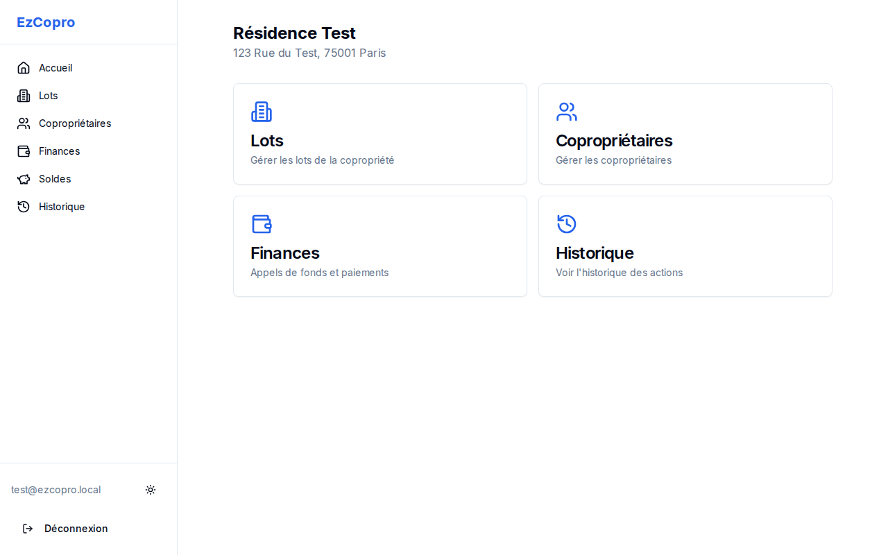
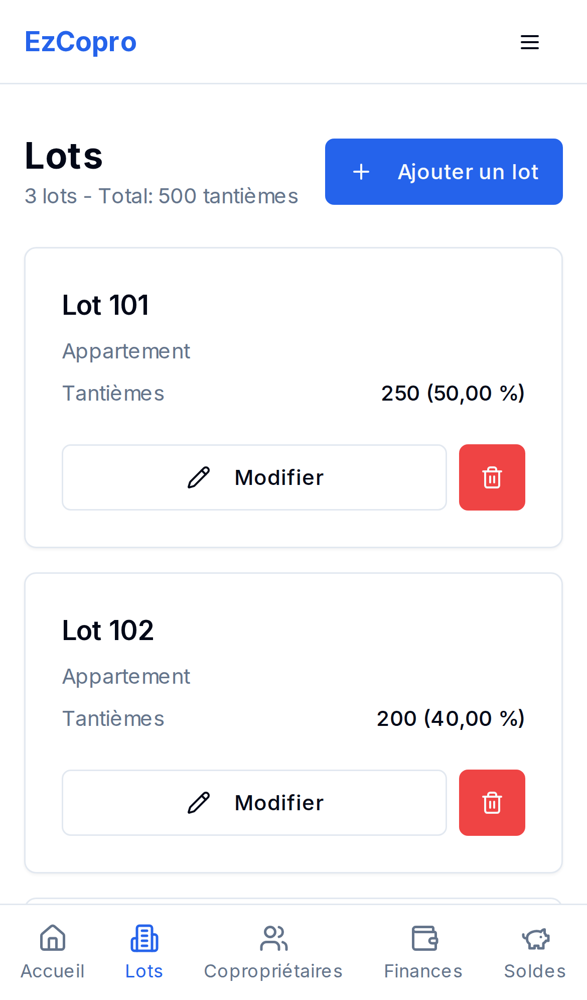
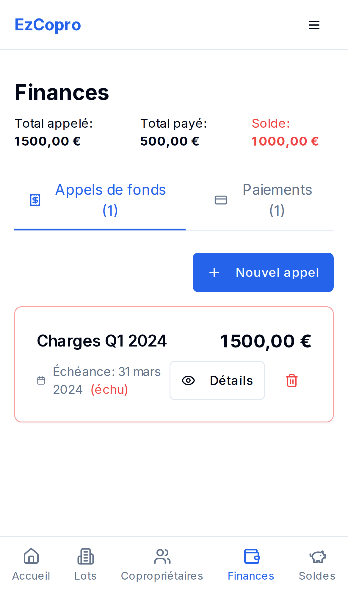

# EzCopro

**La gestion de copropriété simplifiée pour les petites résidences.**

---

<p align="center">
  
</p>

## Pourquoi EzCopro ?

Gérer une petite copropriété ne devrait pas être compliqué. EzCopro est une application web moderne conçue spécifiquement pour les syndics bénévoles et les petites copropriétés qui veulent une solution simple, efficace et accessible.

### Fonctionnalités principales

- **Gestion des lots** - Suivez tous les lots de votre copropriété avec leurs tantièmes
- **Copropriétaires** - Gérez les informations de contact et invitez les copropriétaires à accéder à leurs données
- **Appels de fonds** - Créez des appels de charges avec répartition automatique au prorata des tantièmes
- **Suivi des paiements** - Enregistrez les paiements et suivez les soldes en temps réel
- **Historique complet** - Gardez une trace de toutes les actions effectuées
- **Conformité RGPD** - Anonymisation des données personnelles intégrée

### Conçu pour le mobile

EzCopro est une Progressive Web App (PWA) qui fonctionne parfaitement sur mobile, tablette et desktop. Installez-la sur votre écran d'accueil pour un accès rapide.

<p align="center">
  
  
</p>

---

## Documentation technique

### Stack technologique

| Technologie | Usage |
|-------------|-------|
| **Next.js 14** | Framework React avec App Router |
| **TypeScript** | Typage statique strict |
| **Firebase** | Authentication (Google) + Firestore |
| **Tailwind CSS** | Styling utility-first |
| **Radix UI** | Composants accessibles |
| **Zod** | Validation des schémas |
| **React Hook Form** | Gestion des formulaires |

### Prérequis

- Node.js >= 18.0.0
- npm >= 9.0.0
- Un projet Firebase configuré

### Installation

```bash
# Cloner le repository
git clone https://github.com/your-org/ezcopro.git
cd ezcopro

# Installer les dépendances
npm install

# Configurer les variables d'environnement
cp .env.example .env.local
# Éditer .env.local avec vos credentials Firebase
```

### Variables d'environnement

Créez un fichier `.env.local` avec :

```env
NEXT_PUBLIC_FIREBASE_API_KEY=your-api-key
NEXT_PUBLIC_FIREBASE_AUTH_DOMAIN=your-project.firebaseapp.com
NEXT_PUBLIC_FIREBASE_PROJECT_ID=your-project-id
NEXT_PUBLIC_FIREBASE_STORAGE_BUCKET=your-project.appspot.com
NEXT_PUBLIC_FIREBASE_MESSAGING_SENDER_ID=your-sender-id
NEXT_PUBLIC_FIREBASE_APP_ID=your-app-id
```

---

## Architecture du projet

```
src/
├── app/                      # Next.js App Router
│   ├── (auth)/              # Pages d'authentification
│   │   ├── login/           # Page de connexion
│   │   └── test-login/      # Login pour tests e2e
│   ├── (dashboard)/         # Pages protégées (authentifié)
│   │   ├── dashboard/       # Accueil
│   │   ├── lots/            # Gestion des lots
│   │   ├── coproprietaires/ # Gestion des copropriétaires
│   │   ├── finances/        # Appels de fonds et paiements
│   │   ├── soldes/          # Vue des soldes
│   │   ├── historique/      # Historique des actions
│   │   └── onboarding/      # Création de copropriété
│   ├── layout.tsx           # Layout racine
│   └── providers.tsx        # Providers React (Auth, Toast, etc.)
│
├── components/
│   ├── ui/                  # Composants UI réutilisables (shadcn/ui)
│   └── ...                  # Composants métier
│
├── lib/
│   ├── firebase/
│   │   ├── config.ts        # Configuration Firebase
│   │   └── services/        # Services Firestore (CRUD)
│   │       ├── lot.ts
│   │       ├── coproprietaire.ts
│   │       ├── appel.ts
│   │       ├── paiement.ts
│   │       └── historique.ts
│   ├── hooks/               # Hooks React personnalisés
│   │   ├── useAuth.tsx      # Authentification
│   │   └── useCopropriete.tsx # Contexte copropriété
│   ├── schemas/             # Schémas Zod
│   └── test/                # Données mock pour tests
│       └── mock-data.ts
│
└── tests/
    └── e2e/                 # Tests end-to-end Playwright
        ├── fixtures/        # Fixtures d'authentification
        └── *.spec.ts        # Fichiers de tests
```

### Modèle de données

```
Copropriete
├── id, nom, adresse
├── members[] (user IDs)
├── totalTantiemes
└── createdBy, createdAt, updatedAt

Lot
├── id, numero, type
├── tantiemes
├── coproprietaireId (nullable)
└── description

Coproprietaire
├── id, nom, prenom
├── email, telephone
├── userId (si lié à un compte)
└── isAnonymized (RGPD)

AppelDeFonds
├── id, libelle, montant
├── dateEcheance
└── repartitions[] (par lot)

Paiement
├── id, montant, datePaiement
├── appelId, coproprietaireId
└── moyenPaiement, reference
```

---

## Développement

### Commandes disponibles

```bash
# Développement
npm run dev              # Serveur de dev (http://localhost:3000)
npm run dev:test         # Dev avec mode test (bypass Firebase)

# Build & Production
npm run build            # Build de production
npm run start            # Démarrer le build

# Qualité du code
npm run lint             # ESLint
npm run type-check       # Vérification TypeScript

# Tests unitaires
npm run test             # Exécuter les tests
npm run test:watch       # Mode watch
npm run test:coverage    # Avec couverture

# Tests end-to-end
npm run test:e2e         # Tests Playwright
npm run test:e2e:ui      # Interface Playwright

# Storybook
npm run storybook        # Démarrer Storybook (port 6006)
npm run build-storybook  # Build Storybook
```

### Mode Test

Le projet inclut un **mode test** qui bypass Firebase pour les tests e2e. Ce mode utilise des données mock en mémoire.

```bash
# Démarrer en mode test
npm run dev:test

# Lancer les tests e2e (active automatiquement le mode test)
npm run test:e2e
```

En mode test :
- L'authentification est automatique (utilisateur `test@ezcopro.local`)
- Une copropriété de test est pré-créée avec des lots et copropriétaires
- Toutes les opérations CRUD fonctionnent sur des données en mémoire

---

## Tests

### Tests unitaires (Vitest)

```bash
npm run test
```

Les tests unitaires utilisent Vitest avec React Testing Library.

### Tests end-to-end (Playwright)

```bash
# Installer les navigateurs (première fois)
npx playwright install

# Lancer tous les tests
npm run test:e2e

# Lancer avec l'interface graphique
npm run test:e2e:ui

# Lancer un fichier spécifique
npx playwright test tests/e2e/lots.spec.ts
```

Les tests e2e couvrent :
- Authentification et navigation
- CRUD des lots
- CRUD des copropriétaires
- Gestion des finances (appels et paiements)
- Consultation des soldes
- Historique des actions

---

## Génération des screenshots

Un script permet de générer automatiquement des screenshots pour la documentation.

### Prérequis

```bash
# S'assurer que Playwright est installé
npx playwright install chromium
```

### Générer les screenshots

```bash
# Créer le script de capture
cat > screenshot-script.ts << 'EOF'
import { chromium, devices } from 'playwright';

async function takeScreenshots() {
  const browser = await chromium.launch();

  // Desktop screenshots
  const desktopContext = await browser.newContext({
    viewport: { width: 1280, height: 800 }
  });
  const desktopPage = await desktopContext.newPage();

  await desktopPage.goto('http://localhost:3000/login');
  await desktopPage.evaluate(() => {
    localStorage.setItem('ezcopro_selected_copro_id', 'test-copro-123');
    localStorage.setItem('ezcopro_selected_copro', JSON.stringify({
      id: 'test-copro-123',
      nom: 'Résidence Test',
      adresse: '123 Rue du Test, 75001 Paris',
      members: ['test-user-123'],
      totalTantiemes: 500,
      createdBy: 'test-user-123',
      createdAt: { seconds: Math.floor(Date.now() / 1000), nanoseconds: 0 },
      updatedAt: { seconds: Math.floor(Date.now() / 1000), nanoseconds: 0 },
    }));
  });

  const pages = [
    { url: '/dashboard', name: 'desktop-dashboard' },
    { url: '/lots', name: 'desktop-lots' },
    { url: '/coproprietaires', name: 'desktop-coproprietaires' },
    { url: '/finances', name: 'desktop-finances' },
    { url: '/soldes', name: 'desktop-soldes' },
  ];

  for (const p of pages) {
    await desktopPage.goto(`http://localhost:3000${p.url}`);
    await desktopPage.waitForTimeout(2000);
    await desktopPage.screenshot({ path: `screenshots/${p.name}.png` });
    console.log(`Captured ${p.name}`);
  }

  await desktopContext.close();

  // Mobile screenshots
  const mobileContext = await browser.newContext({
    ...devices['iPhone 12'],
  });
  const mobilePage = await mobileContext.newPage();

  await mobilePage.goto('http://localhost:3000/login');
  await mobilePage.evaluate(() => {
    localStorage.setItem('ezcopro_selected_copro_id', 'test-copro-123');
    localStorage.setItem('ezcopro_selected_copro', JSON.stringify({
      id: 'test-copro-123',
      nom: 'Résidence Test',
      adresse: '123 Rue du Test, 75001 Paris',
      members: ['test-user-123'],
      totalTantiemes: 500,
      createdBy: 'test-user-123',
      createdAt: { seconds: Math.floor(Date.now() / 1000), nanoseconds: 0 },
      updatedAt: { seconds: Math.floor(Date.now() / 1000), nanoseconds: 0 },
    }));
  });

  const mobilePages = [
    { url: '/dashboard', name: 'mobile-dashboard' },
    { url: '/lots', name: 'mobile-lots' },
    { url: '/coproprietaires', name: 'mobile-coproprietaires' },
    { url: '/finances', name: 'mobile-finances' },
    { url: '/soldes', name: 'mobile-soldes' },
  ];

  for (const p of mobilePages) {
    await mobilePage.goto(`http://localhost:3000${p.url}`);
    await mobilePage.waitForTimeout(2000);
    await mobilePage.screenshot({ path: `screenshots/${p.name}.png` });
    console.log(`Captured ${p.name}`);
  }

  await mobileContext.close();
  await browser.close();
  console.log('Done!');
}

takeScreenshots().catch(console.error);
EOF

# Créer le dossier screenshots
mkdir -p screenshots

# Démarrer le serveur en mode test (dans un autre terminal)
npm run dev:test

# Exécuter le script
npx tsx screenshot-script.ts

# Nettoyer
rm screenshot-script.ts
```

Les screenshots seront générés dans le dossier `screenshots/`.

---

## Déploiement

### Vercel (recommandé)

```bash
# Installer Vercel CLI
npm i -g vercel

# Déployer
vercel
```

Configurez les variables d'environnement dans le dashboard Vercel.

### Firebase Hosting

```bash
# Build
npm run build

# Déployer
firebase deploy --only hosting
```

---

## Contribution

1. Forker le projet
2. Créer une branche (`git checkout -b feature/ma-fonctionnalite`)
3. Commiter les changements (`git commit -m 'feat: ajouter ma fonctionnalité'`)
4. Pousser la branche (`git push origin feature/ma-fonctionnalite`)
5. Ouvrir une Pull Request

### Convention de commits

Ce projet suit [Conventional Commits](https://www.conventionalcommits.org/) :

- `feat:` nouvelle fonctionnalité
- `fix:` correction de bug
- `docs:` documentation
- `style:` formatage
- `refactor:` refactoring
- `test:` ajout de tests
- `chore:` maintenance

---

## Licence

MIT - Voir le fichier [LICENSE](LICENSE) pour plus de détails.

---

<p align="center">
  Fait avec ❤️ par l'équipe EzCopro
</p>
